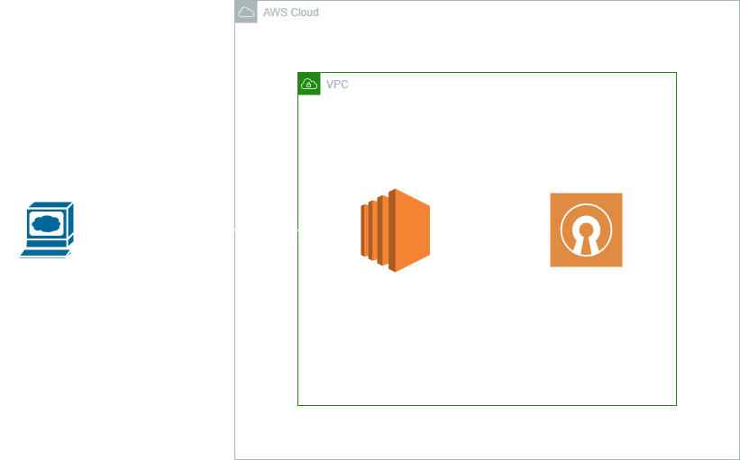

# OpenVPN Deployment on AWS with Terraform

This project automates the deployment of an OpenVPN server on AWS using a Marketplace AMI and Terraform. The infrastructure is managed through Terraform, and AWS SSM is used for secure management of the instance without needing SSH.



## Prerequisites

Before deploying this project, ensure you have the following:

- An AWS account
- Terraform installed on your machine
- AWS CLI installed and configured with appropriate credentials

## Overview

The project is designed to deploy an OpenVPN instance on AWS and manage it via AWS SSM. The VPN instance is launched using a pre-configured OpenVPN AMI from the AWS Marketplace, and you can access the instance securely using AWS SSM Session Manager without needing SSH.

### Key Features

- Automated provisioning of OpenVPN using Terraform
- Management via AWS SSM and Session Manager
- Optional security group configuration for SSH access
- Easily scalable and adaptable infrastructure

## Terraform Files

- `providers.tf`: Specifies the AWS provider and any required provider configurations.
- `variables.tf`: Defines input variables for configuring the infrastructure.
- `datasources.tf`: Contains data sources to gather information about existing AWS resources.
- `locals.tf`: Defines local variables used within the Terraform configuration for reuse.
- `main.tf`: The main Terraform file that provisions the OpenVPN EC2 instance, security groups, and any necessary networking components.

## Usage

### 1. Clone the Repository

Clone this repository to your local machine:

```bash
git clone <repository-url>
cd <repository-directory>
```

The project contains the following files:

* **providers.tf**: Likely defines the providers being used (e.g., AWS).
* **variables.tf**: Contains variables for the Terraform configuration.
* **datasources.tf**: Defines data sources used to gather information about existing resources.
* **locals.tf**: Contains local values used within the Terraform configuration.
* **main.tf**: The main configuration file that likely includes resource definitions.

### 2. Initialize Terraform
Before applying the configuration, initialize the Terraform workspace to download the necessary providers and modules:
```bash
terraform init
```

### 3. Customize Variables
Review and adjust the variables in the variables.tf file according to your needs, such as instance type, region, and AMI ID.

### 4. Apply the Terraform Configuration
Run the following command to deploy the infrastructure:
```bash
terraform apply
```

Review the changes and type yes to confirm the deployment.

### 5. Managing the Instance
You can manage the deployed OpenVPN instance using AWS Systems Manager (SSM) Session Manager. No SSH access is required unless explicitly configured.

To start a session with your instance using the AWS CLI:

```bash
aws ssm start-session --target <instance-id>
```

### 6. Destroy the Infrastructure
When you're done, you can destroy the infrastructure with:

```bash
terraform destroy
```

## Future Enhancements
* Automate OpenVPN certificate generation and configuration using Terraform and null resources.
* Integrate autoscaling features for larger VPN setups.
* Add a CI/CD pipeline for automated deployment and scaling.

## License
This project is licensed under the MIT License. 
